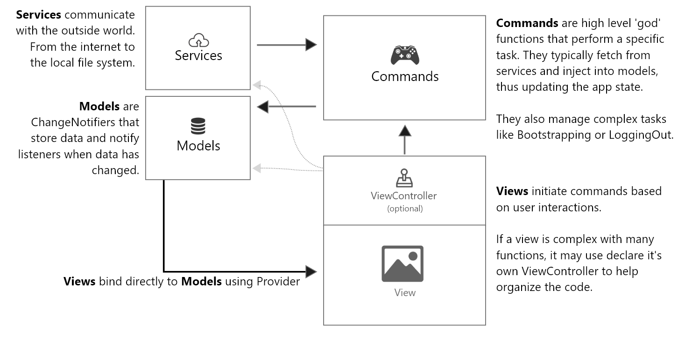

# Reddit App

    <h1 align='center'>⚡️<i>Reddit clone</i>⚡️</h1>
    

    
Amazing Reddit clone - A network of communities where people can dive into their interests, hobbies and passions.

- A Social Network for Communities and Groups - Reddit is a network of communities based on people's interests. Find communities you're interested in, and become part of an online community!

It is the Software Course' project in Faculty of Engineering, Cairo University.

The project aims to design and implement a software product using state-of-the-art tools and technologies in the software industry.

[**Reddit Web API**](https://www.reddit.com/dev/api/).

## Selected Features from Reddit

[Features List](https://docs.google.com/spreadsheets/d/1JDI1iNsRKggG_pek6BaOMwvxPN0BFIyFv6Qi6eoBfuo/edit#gid=0).

## Some Used Practices

**pagination**

**Responsive**

**There is a service to mimic the back-end responses (with fake data) to work without the back-end whenever needed.** 

**Alternating between the real and the mimic back-end is very smooth as we change one variable only.**

**Separation of responsibilities & Smooth Integration.**

**Using package managers.**

**Single Responsibility Principle [SRP]**

**Separation of Duties [SoD].**

**DRY Principle [Don’t Repeat Yourself]**

**Commenting.**

**Formatting and Linting.**

**Naming Convention.**

**Unit Testing.**

**Task Management.**

**Authentication & Authorization.**

**Divide system into multiple modules.**

## Documentaion

**_dartdoc_** package in flutter

Documentation files are in **doc** folder

[dartdoc Package](https://pub.dev/packages/dartdoc).

## Unit Testing

**_flutter_test_** Package for unit testing

**_test_cov_console_** Package for test coverage report

We did unit testing for **Logic functions** in the **Controllers** files

Testing codes are in **_test_** folder 

Each controller's functions test is in a separate file in this folder

**Resources explain using this packages in Unit testing:**

[Unit Testing Source 1](https://youtu.be/75i5VmTI6A0).

[Unit Testing Source 2](https://youtu.be/pgMI5nmAem0).

[Unit Testing Source 3](https://youtu.be/7N1qRivtCWI).

## Naming Convention and Linting Rules

**Formatting Tool:**

VsCode formatting tool

**Linting:**

**_Dart_Linting rules_**

**_flutter_code_style_** package

https://dart.dev/guides/language/effective-dart/style

https://dart.dev/tools/linter-rules

https://pub.dev/packages/dart_style

https://pub.dev/packages/flutter_code_style/score

## Authentication and Authorization

**sign up by Email**

**sign up by Gmail**

**sign up by Facebook**

**Forget password**

**Forget username**

**Fire bsed used in Google and Face Authentication to handle Token**

**Choose your interest, profile picture, gender, username when you first sign up in Reddit**

**Saving login Status in shared prefrence to be kept loged in**

## Interface with BE

**RESTful API** that sends and receives data in JSON format.

**Used Technologies in requests:** _HTTP_ & _DIO_

## Demo Video

## Used Architecture

**MVC+S** architecture

_M_ stands for _models_

_V_ stands for _views_

_C_ stands for _controllers_

_S_ stands for _services_

**Resources for MVC+S in flutter:**

[MVC+S resource 1](https://itnext.io/mvc-s-design-pattern-in-flutter-6eba15169413).

[MVC+S resource 2](https://blog.gskinner.com/archives/2020/09/flutter-state-management-with-mvcs.html).

# Files Structure in lib folder

## Models

Models are data classes.

Each Functionality has a file for its model.

Each model file contains lists for mock data and lists for real data.

## Views

Views are all the Widgets and Pages within the Flutter Application.

It divides into two folders:

**1-Screens:**

This folder contains a folder for each functionality in the Reddit App.

The folder for each functionality contains the Screens of this functionality

**2-Widgets:**

This folder contains a folder for each functionality in the Reddit App.

The folder for each functionality contains the Widgets used in the screens of this functionality

## Controllers

The controller layer is high-level functions that perform a specific type of task.

**State management logic goes in here.**

Contains Two types of controllers:

1-UI controllers that has the logic that deals with UI layer and update app state according to user interactions.

2-controllers thet typically fetch from services and inject them into models and that way they control and update app state.

## Services

Services fetch data from the outside world and return it to the app. Commands call on services and inject the results into the model. Services do not touch the model directly.

Whatever data that comes into our APP must have to be from here. It is connecting with REST API.

There is a file for each functionality service.

## Funcional Documentaion

**_dartdoc_** package in flutter

Documentation files are in **doc** folder

[dartdoc Package](https://pub.dev/packages/dartdoc).

## Unit Testing

**_flutter_test_** Package for unit testing

**_test_cov_console_** Package for test coverage report

We did unit testing for **Logic functions** in the **Controllers** files

Testing codes are in **_test_** folder 

Each controller's functions test is in a separate file in this folder

**Resources explain using this packages in Unit testing:**

[Unit Testing Source 1](https://youtu.be/75i5VmTI6A0).

[Unit Testing Source 2](https://youtu.be/pgMI5nmAem0).

[Unit Testing Source 3](https://youtu.be/7N1qRivtCWI).

## Naming Convention and Linting Rules

**Formatting Tool:**

VsCode formatting tool

**Linting:**

**_Dart_Linting rules_**

**_flutter_code_style_** package

https://dart.dev/guides/language/effective-dart/style

https://dart.dev/tools/linter-rules

https://pub.dev/packages/dart_style

https://pub.dev/packages/flutter_code_style/score

## Authentication and Authorisation 

**sign up by Email**

**sign up by Gmail**

**sign up by Facebook**

**Forget password**

**Forget username**

**Fire bsed used in Google and Face Authentication to handle Token**

**Choose your interest, profile picture, gender, username when you first sign up in Reddit**

**Saving login Status in shared prefrence to be kept loged in**

## Interface with BE

**RESTful API** that sends and receives data in JSON format.

## 🎥 Demo Video

## Contributors

**Team Leader:**

[Kareem Ashraf](https://github.com/kareem37).

**Flutter Developers:**

[Ahmed Hany](https://github.com/Ahmed-H300).

[Donia Gameel](https://github.com/DoniaGameel).

[Heba Ashraf](https://github.com/hebaashraf21).

[Mamdouh Attia](https://github.com/Mamdouh-Attia).

[Mohammed Sobhy](https://github.com/Sobhiu).

[Kareem Ashraf](https://github.com/kareem37).

**DevOps:**

[Waleed Hesham](https://github.com/waleedhesham446).

